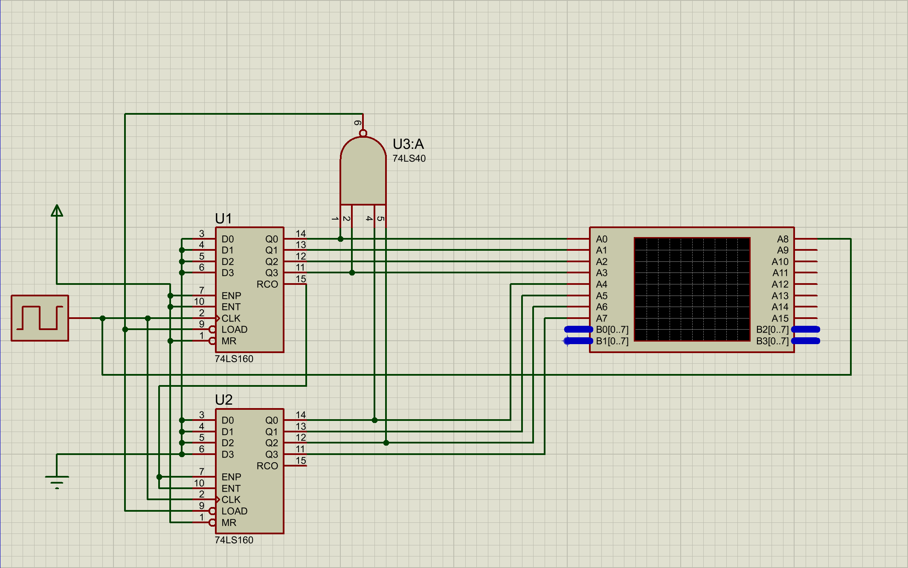

# 数字电路实验报告（实验十五）

**姓名：** 廖海涛  
**学号：** 24344064  
**日期：** 2026-05-19

## 一、实验题目

基于 74LS160 级联的六十进制计数器设计与显示实现

## 二、实验目的

1. 掌握利用集成同步计数器实现任意进制计数的方法。  
2. 理解 74LS160 的异步清零、同步置数及级联应用。  
3. 掌握用 74LS157 数据选择器实现两组计数数据的动态显示。  
4. 完成六十进制（00～59）计数功能并进行结果验证。

## 三、实验设备

1. 数字电路实验箱、逻辑分析仪（或示波器数字通道）。  
2. 主要器件：74LS160（十进制同步计数器）×2、74LS157（数据选择器）。  
3. 数码显示模块、连接导线、板载时钟与按键资源。

## 四、实验原理

### 1. 任意 \(N\) 进制计数器实现思路

当现有计数器模数 \(M \ge N\) 时，可利用清零端或置数端在达到目标状态后强制回到初态；当 \(M < N\) 时，需要通过级联扩大计数范围。  
本实验采用两片 74LS160 级联，分别实现个位与十位计数，构成六十进制计数器。

### 2. 六十进制状态约束

计数范围为 00～59，因此十位仅允许 0～5，个位允许 0～9。  
根据设计草稿中“59 = (4 + 1) × 10 + (8 + 1)”的思路，在组合逻辑检测到“59 对应边界状态”后，通过置数/清零控制使下一拍回到 00。

### 3. 关键控制逻辑

实验采用如下控制表达式（草稿推导）：

\[
\mathrm{PE}=\operatorname{NAND}(Q_{22},Q_{20},Q_{13},Q_{10})
\]

该逻辑用于在特定状态触发有效控制信号，保证计数序列维持在 00～59 的循环范围。

### 4. 显示原理

利用 74LS157 对两组 4 位计数数据进行选择输出，并配合位选扫描实现数码管显示，使十位与个位数据能够稳定显示为当前计数值。

## 五、方法与步骤

1. 按六十进制目标序列确定个位、十位计数器的级联关系与进位连接。  
2. 在 Proteus 中搭建电路原理图：完成两片 74LS160 的时钟、清零、置数及级联连线，先验证 00～59 的循环计数。  
3. 按推导逻辑搭建状态检测与控制信号电路，确保在边界状态后返回 00。  
4. 接入 74LS157 与显示模块，完成十位/个位数据选择与动态显示。  
5. 运行仿真，记录电路原理图、数码管显示结果与关键波形，并与理论序列对照。

## 六、验证（结果）

### 1. 电路连接图

电路由两片 74LS160 级联构成，配合组合逻辑实现六十进制状态约束；74LS157 负责十位与个位数据的动态选择输出到数码管模块。原理图结构与设计一致。

### 2. 波形观测

#### 0 → 10 计数的 Q₀~Q₃ 与 CLOCK 波形

.png)

在 0→10 的初始阶段，各位输出遵循二进制递增规律，十位尚未进位，波形关系符合预期。

#### 0 → 60 计数的 Q₀~Q₃ 与 CLOCK 波形

.png)

完整 0→60 波形中，十位 Q₂ 在个位达到 9 后产生进位沿，随后继续递增；在到达 59 后的下一拍归零，循环重入 00，与设计设定的六十进制边界逻辑一致。

### 3. 数码管显示

#### 起始状态（00）

数码管显示为 00，计数起始状态与设计一致。

#### 边界状态（59）

数码管正确显示 59，表明计数器能在上限状态下稳定输出。

### 4. 结果小结

综合电路原理图、波形观测与数码管显示三方面验证：六十进制计数循环功能正常，状态迁移与设计推导一致，无异常跳变或死锁现象。

## 七、思考与提高

### 1. 为什么六十进制实现中常采用“计数 + 状态检测”结构

通用计数器器件本身通常提供固定模数（如十进制计数），通过级联获得足够状态数后，再用组合逻辑截断到目标范围，可在器件数量、连线复杂度和可调性之间取得平衡。对于 60 进制这类非 \(2^n\) 进制场景，该方法实现直接且可靠。

### 2. 同步置数/清零与异步清零在本实验中的作用差异

异步清零可用于快速初始化；同步置数/同步控制更利于在时钟边沿统一更新状态，减小显示切换中的瞬态不一致。实验中将两类控制配合使用，可兼顾启动便捷性与计数过程稳定性。

### 3. 若扩展到 24 小时计时（00:00:00）应如何处理

可采用“分级模数”思路：秒和分使用 60 进制，小时使用 24 进制，并在各级之间建立进位关系；对每一级分别设计上限检测与回零逻辑，再统一到时钟驱动框架中，即可构成完整时钟计数系统。

## 八、分析与讨论

1. 本实验核心在于将器件固定模数能力与目标模数需求结合：先级联扩展，再通过状态检测进行范围约束。  
2. 74LS160 的控制端特性决定了设计中“时序控制优先”的实现方式，合理使用置数/清零可提升序列稳定性。  
3. 波形图中个位 Q₀~Q₃ 的翻转频率依次减半，符合二进制计数分频关系；十位进位沿位置准确，说明级联时序正确。  
4. 74LS157 的引入使显示链路更清晰，验证过程中关键状态显示与设计一致，说明计数与显示两部分配合正常。  
5. 通过本实验进一步加深了对"任意进制计数器设计流程（目标序列→状态约束→控制逻辑→显示验证）"的理解。
